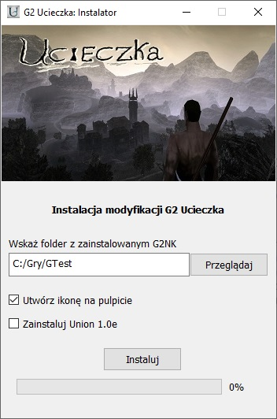

# G2UcieczkaInstaller

Instalator modyfikacji G2 Ucieczka (G2NK).

Program rozpakowywuje pliki moda do odpowiednich katalogów.  
Skrót na pulpicie jest tworzony przy użyciu ShlObj.  
(UI składane za pomocą QT Designera)
