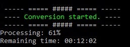

# GothicDecibelsModulator

Program napisany do podgłośnienia 6000 plików dźwiękowych o około 3dB.  
Aby zadziałał poprawnie należy mieć do zmiennych systemowych  
dodany folder z lokalizacją programu ffmpeg.exe.

Generuje maksymalnie znormalizowane pliki WAV, które odczytuje Gothic:
```bash
kodek: adpcm_ima_wav
próbkowanie: 44,100 kHz
bitrate: 177k
-> bez metadanych
```


